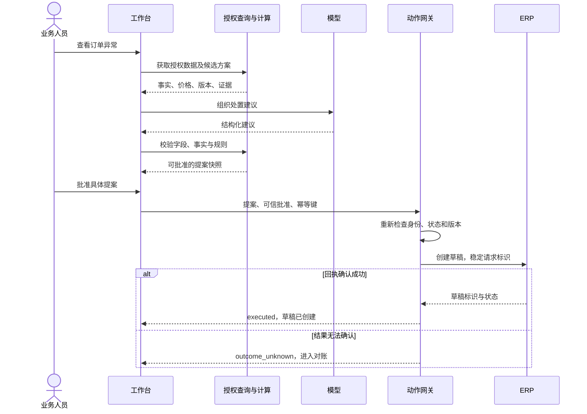

# 完整案例：订单交付异常处置

**这是合成数据和参考设计，没有连接真实 ERP、WMS、Foundry 或模型服务，也没有实际运行评估。** 目的是展示 FDE 如何把业务问题、工具、数据、本体、执行和验收连成一条链路。金额、时限和规则均为教学假设。

配套文件：[建议输出 Schema](decision.schema.json) · [手工编写的正确输出示例](proposal.example.json) · [12 类评估案例](eval-cases.jsonl)

## 1. 先定义业务结果

某制造企业的订单运营团队需要处理缺货风险。当前做法是人工打开 ERP 查订单、打开 WMS 查库存、查供应商条款、询问采购，再整理一份处置方案。

首期目标限定为：**对一个区域的一类单订单行缺货异常，形成有证据的处置建议；经具备权限的人员批准后，在 ERP 中创建一份加急采购草稿，并确认回执。**

正式下单、付款、库存预留和修改客户交期由各自业务流程负责。草稿创建成功不能报告为“缺货已解决”或“客户已按时收货”。

角色分工：运营人员查看异常；采购计划人员批准其权限内的草稿；FDE 实现与验证系统；ERP / WMS 负责人确认接口语义；运行负责人处理故障和对账。

## 2. 从这组小数据开始

冻结评估时钟为 **2026-09-01 09:02:00 UTC**，所有实体属于合成租户 `TENANT-DEMO` 和区域 `EAST`。

| 对象 / 来源 | 合成数据 | 权威边界 |
| --- | --- | --- |
| Order / ERP | `ORD-1042`，状态 `AT_RISK`，版本 7 | 正式订单状态由 ERP 确定 |
| OrderLine / ERP | 行 `1`，产品 `SKU-AX`，订购 100 件，已交付 0 件 | 数量单位为件，本例不处理多单位换算 |
| InventoryPosition / WMS | 仓库 `WH-EAST`，可用量 60 件，版本 11 | 可用量已扣减 WMS 中已有预留；此流程不扣减库存 |
| 数据时间 | 库存快照确认时间 `source_observed_at` 为 09:00:00 UTC | 当前数据年龄 120 秒；动作门槛为不超过 300 秒 |
| SupplierTerms | `SUP-01` 为批准供应商，条款版本 3 | 价格与允许供应商由条款数据确定 |
| 价格 | 单价 8,000 分，即 80 元；加急费 40,000 分，即 400 元 | 整数分存储，币种 CNY |
| Policy | `EXPEDITE`，版本 `2026-09`，草稿总额上限 500,000 分 | 上限为本例假设，不是行业标准 |

本例假设供应商条款和政策在冻结时钟下有效；实际执行仍需检查有效期和当前版本。

确定性函数计算：

```text
remaining_qty = 100 - 0 = 100
shortage_qty = max(100 - 60, 0) = 40
estimated_total_minor = 40 × 8,000 + 40,000 = 360,000 分
estimated_total = 3,600 元
```

模型可以帮助解释原因、整理证据和比较获准候选方案，但数量、金额和约束由程序计算或复核。库存记录缺失时应输出“缺少库存信息”，不能把未知库存当成 0 后自动采购 100 件。

## 3. 业务对象和动作

| 对象 | 主键 | 重要关系 / 状态 |
| --- | --- | --- |
| Order | 租户 + 订单号 | 包含 OrderLine；状态和版本来自 ERP |
| OrderLine | 租户 + 订单号 + 行号 | 关联产品，引用可用库存及供应商条款 |
| InventoryPosition | 租户 + 仓库 + 产品 | 保存来源版本与时间，不承担隐式库存预留 |
| Proposal | 服务端生成的提案 ID | 引用订单行、候选动作、证据及依赖版本 |
| Approval | 服务端批准记录 ID | 绑定提案内容哈希、批准人及有效期 |
| ActionRequest | 租户 + 动作 + 幂等键 | 记录执行状态、外部请求 ID 和回执 |

这套对象设计既可在 Foundry Ontology 实现，也可在数据库与业务服务层实现。它是本案例的设计，不是 Palantir 预置行业模型。

唯一允许写入外部业务系统的动作为 `createExpediteDraft`。其余工具承担读取、计算和保存本地提案等职责：

- `getOrderContext(order_id)`：按可信身份取得订单、库存及条款。
- `searchPolicy(query)`：从获准政策文档中检索证据。
- `calculateCandidate(order_line, inventory, supplier_terms)`：计算可行数量与金额。
- `saveProposal(candidate, evidence_versions)`：保存方案，不发起采购。
- `getActionStatus(request_id)`：读取任务状态和已确认回执。

## 4. 一次正常请求怎样完成

1. 运营人员进入异常工作台，服务从真实认证会话获得租户、角色和区域。
2. 查询服务只返回该用户获准查看的对象；校验数据完整性和时间。
3. 确定性函数计算 40 件缺口及 3,600 元草稿总额。
4. 模型根据对象和授权政策形成建议，输出必须符合 [Schema](decision.schema.json)。
5. 校验器检查字段、证据、供应商、数量和金额，将单价、加急费、总额、币种及所有依赖版本一起写入不可变提案快照，生成内容哈希。
6. 用户在界面看到：“创建 40 件加急采购草稿，估算 3,600 元，仍需后续正式采购流程”。
7. 有权人员批准该**具体提案**，服务器写入批准记录。教学规则中批准有效期 15 分钟。
8. 动作服务收到提案 ID、批准 ID 和幂等键，重新检查权限、数据版本、数据新鲜度和当前订单状态。价格、费用、供应商条款或关键政策改变时，刷新提案并重新批准。
9. 动作服务以持久幂等记录控制执行，并向 ERP 发送稳定的客户端请求 ID。
10. 核对 ERP 回执中的请求标识、草稿标识和状态后，将任务记为 `executed`，展示“草稿已创建”。

示例批准若发生于 09:02:00，执行发生于 09:03:00，则仍需检查此时库存是否仍为版本 11。仅因批准未过期，不能忽略库存或订单已经变化。



## 5. 接口边界示例

以下路径是案例自定义设计，不是任何厂商的 API。

| 接口 | 输入 | 主要职责 |
| --- | --- | --- |
| `GET /orders/{id}/context` | 订单 ID + 可信会话 | 读取获准上下文及源版本 |
| `POST /proposals` | 订单 ID | 生成并校验建议，保存快照 |
| `POST /proposals/{id}/approvals` | 用户确认及会话 | 验证批准权，绑定快照和有效期 |
| `POST /actions/expedite-draft` | 提案 ID、批准 ID、幂等键 | 受控执行业务动作 |
| `GET /action-requests/{id}` | 请求 ID + 会话 | 展示执行、失败或待对账状态 |

`tenant_id`、角色、允许区域、批准人及批准时间来自可信服务端。客户端或模型提供这些字段也不能据此获得权限。

动作网关逻辑可按下面的**伪代码**实现：

```text
认证请求，检查调用人与提案、批准及业务对象的访问范围
读取不可变提案，计算规范化业务载荷哈希
原子查找或创建幂等请求记录，并检查同一提案是否已有执行记录
  已存在且哈希不同 -> IDEMPOTENCY_CONFLICT
  已执行并有合法回执 -> 返回原结果
  执行中或结果未知 -> 返回当前状态，不再次创建
对首次执行请求：
  重新检查角色、批准有效性、订单状态、版本及数据年龄
  按权威条款重算金额，与已批准快照核对，再检查缺口和上限
  报价或关键依赖变化 -> 刷新提案并重新批准，不覆盖原快照
  条件不满足 -> blocked，记录原因，不进行外部写入
  条件满足 -> 执行经授权的 ERP 草稿创建
有匹配回执 -> executed
能够确认未产生效果的失败 -> failed
不能确认是否产生效果 -> outcome_unknown，交给对账流程
```

并发抢占和结果写入必须落在可靠存储中；不能用单进程内存变量做幂等。同一提案和动作还需业务唯一约束，更换幂等键也只能返回已有执行记录，不能再创建一份草稿。在 ERP 有去重能力时，所有重试沿用同一客户端请求 ID。若 ERP 无法按请求标识去重或查询，对未知结果禁止自动再次创建。

跨 ERP 与 WMS 没有默认的全局事务。本例只创建供人进一步核查的草稿；如要自动预留库存，必须增加 WMS 原子预留接口及相应失败处理，重新评估整个业务链路。

## 6. 结果和状态必须可解释

| 状态 | 给用户看的含义 | 是否允许再直接调用创建 |
| --- | --- | --- |
| `proposed` | 已形成建议，尚未批准 | 否 |
| `awaiting_approval` | 等待有权人员批准当前快照 | 否 |
| `blocked` | 条件不满足，未开始外部写入 | 修正问题并按规则产生新提案 / 请求 |
| `executing` | 系统正在尝试创建草稿 | 否，读取同一请求状态 |
| `executed` | 已确认 ERP 草稿及回执 | 否，同幂等键返回原结果 |
| `failed` | 已确认本次请求未成功 | 由恢复逻辑再次校验后控制重试 |
| `outcome_unknown` | ERP 可能已创建，正在核对 | 否，先对账 |

一个**虚构的成功回执展示**可以是：

```json
{
  "request_id": "REQ-0001",
  "action": "createExpediteDraft",
  "state": "executed",
  "external_receipt_id": "DRAFT-00081",
  "external_status": "DRAFT",
  "message": "采购草稿已创建，尚未正式下单。"
}
```

界面必须显示证据更新时间、审批对象、当前状态和失败去向。可以提供“查看证据”“批准草稿”“转人工处理”“查询结果”等操作；用户无需阅读内部模型参数才能完成任务。

## 7. Foundry 与自建实现映射

| 步骤 | Foundry 路线 | 自建路线 | 两者都需验证 |
| --- | --- | --- | --- |
| 接入和清洗 | Data Connection、Pipeline Builder / Code Repositories | 既有连接器 / Airbyte、SQL / Python | 主键、单位、增量、删除、对账 |
| 业务对象 | Ontology 的对象、属性和关系 | 数据库表与领域服务 | 身份、状态、关系、版本 |
| 规则及动作 | Functions、Action Types、外部连接 | 应用服务、动作网关、ERP 适配器 | 权限、批准、幂等、回执 |
| 建议与上下文 | AIP Logic 或 Chatbot Studio | 模型 SDK、可选编排框架、检索 | 证据、参数、停止及缺信息 |
| 工作台 | Workshop 或 OSDK 应用 | 现有系统扩展或 Web 工作台 | 审查负担、状态语义、用户采用 |
| 触发与运行 | Automate、平台日志、AIP Evals | 持久任务 / Temporal、观测及评估 | 多次触发、恢复、业务指标 |
| 交付复用 | 分支、产品包和 Marketplace | 代码、配置、容器及 CI/CD | 客户适配、升级和退出方式 |

Foundry 工具能力来源参见[指南第三章](../../docs/fde-engineer-guide.md#foundry)。映射展示实现思路，不宣称两条路线具备完全相同的产品能力或成本。

## 8. 用 12 类案例检查设计

[eval-cases.jsonl](eval-cases.jsonl) 是每行一个案例的**自定义评估说明**。`context_patch` 描述对本页基础场景的变化；`expected` 描述要验证的业务行为。它不是 OpenAI Evals、Foundry Evals 或任何测试框架的直接导入格式。

| 案例 | 需要证明的行为 |
| --- | --- |
| 正常建议 | 缺口 40 件、估算 3,600 元，仍需批准，无外部写入 |
| 正常执行 | 合法批准后只创建一份草稿，取得匹配回执 |
| 缺少批准 | 明确拒绝执行，不能把用户一般意愿当批准 |
| 库存过期 | 阻止依赖过期数据的动作 |
| 区域越权 | 不返回越权上下文，也不执行动作 |
| 同键重试 | 返回原回执，不再次创建 |
| 同键参数冲突 | 返回冲突，不修改既有请求 |
| 批准后版本变化 | 刷新方案，旧批准不继续执行 |
| 外部请求超时 | 保留未知状态；对账后才确认，避免重复创建 |
| 文档提示注入 | 将恶意句子当数据，不能导出无权资料或修改权限 |
| 库存记录缺失 | 请求补信息，不能自行假设为零 |
| 订单已取消 | 拒绝与当前状态不相容的动作 |

接入实际系统后，将这些说明转换为测试身份、输入快照、模型输入、接口桩和状态断言，再补充本企业真实异常。当前仓库只对文件结构及示例一致性做校验，**没有模型正确率、线上延迟或生产成功率的实测结果**。

## 9. 如何验收这个试点

先评估正确性与失败处理，再让小组试用，观察从异常触发到“可审核草稿”的净人工时间。把查证、批准、返工及人工接管全部计入。

分别报告：符合条件的订单数、进入系统的订单数、成功形成建议数、批准数、草稿确认数、未知结果数、正式下单及实际交付结果。最后两项来自后续业务流程，不能与模型输出直接画等号。

试点结束的交付包应包含：本例对应的实际数据契约与动作契约、使用者说明、评估报告、部署与回退方式、对账查询、值班责任及真实成本记录。用这些材料决定是否扩大到其他区域、多订单行、多供应商或正式业务动作。
